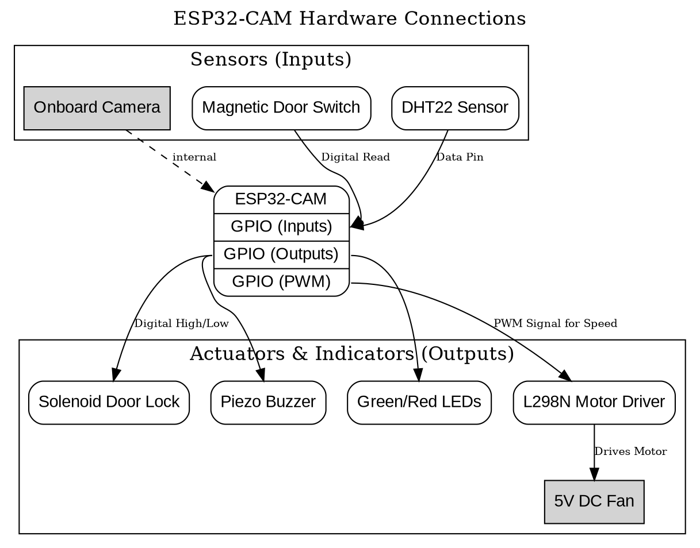

Of course. Here is a comprehensive and professional `README.md` file for your "Smart Server Room Monitor" project. You can copy and paste this directly into your project's repository.

---

# Smart Server Room Monitor

An end-to-end IoT solution for providing real-time security monitoring and automated climate control for critical infrastructure environments. This project leverages an ESP32-CAM for on-site sensing and a Raspberry Pi gateway for data processing, analysis, and hosting a user-facing control panel built with Streamlit.

## Key Features

*   ✅ **Real-Time Security Alerts:** Detects unauthorized door entries using a magnetic switch.
*   ✅ **Photographic Evidence:** Captures an image with the ESP32-CAM the moment the door is opened.
*   ✅ **Automated Climate Control:** A self-regulating fan system adjusts its speed based on real-time temperature readings to maintain optimal conditions.
*   ✅ **Remote Monitoring & Control Panel:** A web-based Streamlit application provides a live dashboard with temperature charts, a security event log with images, and controls to manage the system remotely.
*   ✅ **Two-Way Communication:** The system not only sends data to the cloud but also receives commands from the UI (e.g., "Remote Unlock," "Toggle Maintenance Mode").

## System Architecture

The system is designed with a clear separation of concerns, dividing tasks between a lightweight embedded device (ESP32-CAM) and a powerful edge gateway (Raspberry Pi).

```graphviz
digraph System_Architecture {
    rankdir=LR;
    graph [label="High-Level System Architecture", labelloc=t, fontsize=16];
    node [shape=box, style=rounded, fontname="Arial"];
    edge [fontsize=10];

    subgraph cluster_hardware {
        label="On-Site Hardware (Server Room)";
        ESP32 [label="ESP32-CAM Node"];
    }

    subgraph cluster_backend {
        label="Backend & Cloud (on Raspberry Pi)";
        RPi [label="Raspberry Pi 5\n(Gateway, Logic, Web Server)"];
        Firebase [label="Firebase\n(Database & Storage)", shape=database];
    }
    
    subgraph cluster_ui {
        label="User Interface";
        Streamlit [label="Streamlit Control Panel\n(Web Browser)"];
    }

    // Data Flow (Blue)
    ESP32 -> RPi [label=" 1. Publishes Events &\n     Sends Images", color=blue, fontcolor=blue];
    RPi -> Firebase [label=" 2. Stores Logs &\n    Images", color=blue, fontcolor=blue];
    Firebase -> Streamlit [label=" 3. Reads Data for Display", dir=back, color=blue, fontcolor=blue];
    
    // Command Flow (Red)
    Streamlit -> RPi [label=" 4. Sends User Commands\n    (e.g., 'Unlock')", color=red, fontcolor=red];
    RPi -> ESP32 [label=" 5. Relays Commands\n    via MQTT", color=red, fontcolor=red];
}
```



## Hardware & Components

| Component | Role in Project | Quantity |
| :--- | :--- | :--- |
| **ESP32-CAM** | Primary microcontroller for sensing and actuation. | 1 |
| **Raspberry Pi 4/5** | Central gateway, backend server, and app host. | 1 |
| **Magnetic Reed Switch**| Door open/close sensor. | 1 |
| **DHT22** | Temperature and humidity sensor. | 1 |
| **5V Solenoid Lock**| Electronically controlled door lock. | 1 |
| **L298N Motor Driver**| Controls the speed and power for the fan. | 1 |
| **5V DC Fan** | The cooling actuator. | 1 |
| **Piezo Buzzer** | Provides audible alarms. | 1 |
| **LEDs (Red, Green)**| Visual status indicators. | 2 |

### Hardware Connections Diagram

This diagram shows the wiring for the ESP32-CAM node.



## Logical Flow: Unauthorized Access Alert

This sequence outlines the system's response during a security breach.

1.  **Trigger:** The magnetic switch detects the door has opened.
2.  **Capture:** The ESP32-CAM immediately takes a picture.
3.  **Notify:** The ESP32 sends two things to the Raspberry Pi:
    *   An MQTT message: `{"event": "door_opened", "temp": 25.4}`.
    *   The image file via an HTTP POST request.
4.  **Authorize:** The Raspberry Pi gateway receives the notifications and checks the "Maintenance Mode" flag in Firebase. If the flag is `false`:
5.  **Alert:**
    *   The Pi sends an MQTT command `{"action": "buzz_on"}` back to the ESP32.
    *   The Pi uploads the captured image to Firebase Storage.
    *   The Pi writes a "CRITICAL" event log to the Firebase Realtime Database, including the timestamp and the URL of the newly uploaded image.
6.  **Display:** The Streamlit dashboard, listening to the database, immediately updates to show the new critical alert and the captured image.

## Technology Stack

-   **Embedded:** Arduino (C++) on the ESP32-CAM.
-   **Backend & Gateway:** Python 3 on the Raspberry Pi.
-   **Web Framework:** Streamlit.
-   **Communication Protocol:** MQTT (for device-to-cloud messaging).
-   **Cloud Database:** Firebase Realtime Database.
-   **Cloud Storage:** Firebase Cloud Storage for images.

## Project Structure

```
smart-server-room/
├── esp32-cam-code/
│   └── esp32_cam_firmware.ino    # Main code for the ESP32-CAM
├── raspberry-pi-code/
│   ├── gateway.py                # Main service for MQTT, image reception, and Firebase logic
│   ├── dashboard.py              # The Streamlit web application
│   ├── requirements.txt          # Python dependencies for the Pi
│   └── serviceAccountKey.json    # Firebase admin credentials
└── README.md
```

## Setup and Installation

### 1. Hardware Assembly
Assemble the physical components according to the Hardware Connections Diagram. Use a breadboard for initial prototyping.

### 2. Firebase Setup
1.  Create a new project in the [Firebase Console](https://console.firebase.google.com/).
2.  Enable **Realtime Database** (start in Test Mode).
3.  Enable **Cloud Storage** (start with default rules).
4.  Go to `Project Settings -> Service Accounts`, generate a new private key, and save the downloaded file as `serviceAccountKey.json` in the `raspberry-pi-code` directory.

### 3. ESP32-CAM Setup
1.  Open `esp32_cam_firmware.ino` in the Arduino IDE.
2.  Ensure you have the ESP32 board manager installed. Select "AI Thinker ESP32-CAM" as your board.
3.  Install necessary libraries (`WiFi`, `HTTPClient`, etc.).
4.  Update the placeholder variables for WiFi credentials, MQTT broker IP, and the Raspberry Pi's IP address.
5.  Upload the code to the ESP32-CAM.

### 4. Raspberry Pi Setup
1.  Clone this repository to your Raspberry Pi.
2.  Navigate to the `raspberry-pi-code` directory.
3.  Install the required Python packages:
    ```bash
    pip install -r requirements.txt
    ```

## How to Run

1.  Power on the assembled ESP32-CAM device. The green LED should indicate its status.
2.  On the Raspberry Pi, open two separate terminal windows.
3.  In the first terminal, start the gateway service:
    ```bash
    cd raspberry-pi-code
    python3 gateway.py
    ```
4.  In the second terminal, start the Streamlit dashboard:
    ```bash
    cd raspberry-pi-code
    streamlit run dashboard.py
    ```
5.  Access the control panel by opening a web browser and navigating to the IP address provided by Streamlit.

## Team & Roles

-   **Member 1 (Embedded Systems):** Responsible for the `esp32-cam-code` and all hardware integration.
-   **Member 2 (Gateway & Ingestion):** Responsible for the image reception endpoint and Firebase Storage upload logic within `gateway.py`.
-   **Member 3 (Backend Logic):** Responsible for the MQTT handling, database logic, and command publishing within `gateway.py`.
-   **Member 4 (Application & UI):** Responsible for developing the entire `dashboard.py` Streamlit application.
