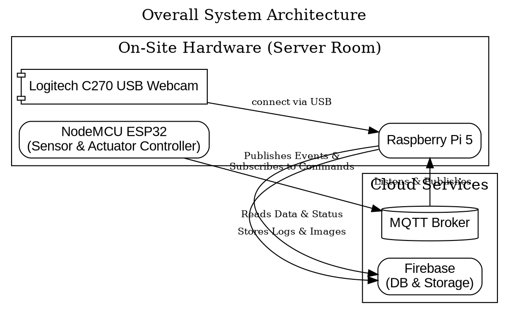
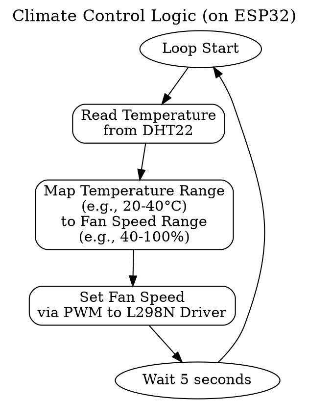
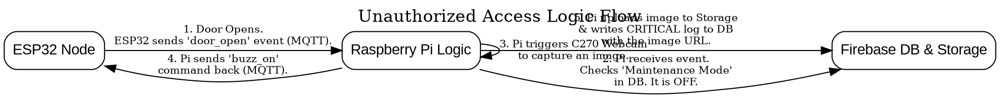

# BMIT2123 IoT Project: Smart Server Room Monitor

**Project Title:** Smart Server Room Monitor with Remote Control & Security Alerts

**Team Members:**
*   [Member 1 Name]
*   [Member 2 Name]
*   [Member 3 Name]
*   [Member 4 Name]

**Project Category:** Smart Manufacturing for Factories of the Future (Protecting Critical IT Infrastructure)


## 1. Project Overview

Server rooms are the nerve center of any organization, yet they are vulnerable to two major threats: **unauthorized physical access** and **environmental failures** like overheating. This project is a comprehensive, end-to-end IoT system designed to provide intelligent, active monitoring and control for such a critical environment.

The system combines a physical sensor-and-actuator node with a powerful backend gateway and a web-based user interface. It actively manages room temperature with a variable-speed fan, physically secures the door with a solenoid lock, and provides instant security alerts with photographic evidence upon a potential breach.

## 2. Key Features

-   **Real-Time Security Alerts:** Instant notification with photographic evidence when the door is opened without authorization.
-   **Audible & Visual Alarms:** A loud buzzer and flashing LED provide immediate on-site alerts during a security breach.
-   **Remote Door Control:** The door can be unlocked remotely via the web dashboard using a secure command flow.
-   **Automated Climate Control:** A variable-speed fan automatically adjusts its speed to maintain a stable room temperature, preventing hardware damage.
-   **Interactive Web Dashboard:** Built with Streamlit, the UI provides live data gauges, historical charts, a security event log with images, and system controls.
-   **Maintenance Mode:** A software toggle to allow for authorized physical access without triggering security alarms.

---

## 3. System Architecture

The system utilizes a robust, distributed architecture that separates on-site tasks from backend processing. This design enhances reliability, security, and scalability.

-   **NodeMCU ESP32:** Acts as the dedicated "field device." Its sole responsibilities are to read local sensors, control local actuators, and communicate efficiently with the gateway.
-   **Raspberry Pi 5:** Serves as the central "gateway" and application server. It handles all heavy processing, secure communication with cloud services, hosts the user-facing web application, and manages the USB webcam.



---

## 4. Hardware & Components

| Role | Component | Connection Point | Purpose |
| :--- | :--- | :--- | :--- |
| **Microcontroller**| **NodeMCU ESP32** | N/A | Reads sensors, controls all local actuators, communicates via MQTT. |
| **Gateway** | **Raspberry Pi 5** | N/A | Runs all backend logic, the web app, and interfaces with the webcam. |
| **Camera** | **Logitech C270** | **Raspberry Pi (USB)** | Captures images upon security trigger. |
| **Sensor 1** | **Magnetic Reed Switch**| ESP32 (GPIO) | Detects if the door is open or closed. |
| **Sensor 2** | **DHT22** | ESP32 (GPIO) | Measures ambient temperature and humidity for climate control. |
| **Actuator 1** | **5V DC Fan** | L298N Motor Driver | Actively cools the server room. |
| **Actuator 2** | **L298N Motor Driver** | ESP32 (PWM) & Fan | Enables variable speed control of the fan. |
| **Actuator 3** | **5V Solenoid Lock** | ESP32 (GPIO via Relay) | Physically secures the door. |
| **Actuator 4** | **Piezo Buzzer** | ESP32 (GPIO) | Provides an audible alarm during an unauthorized access event. |
| **Indicator 1** | **Red LED** | ESP32 (GPIO) | Visual indicator for a critical security alert. |
| **Indicator 2** | **Green LED** | ESP32 (GPIO) | Visual indicator for normal system status and WiFi connection. |

---

## 5. Logical Flows

### a. Climate Control Flow (Continuous Local Loop)

This logic runs autonomously on the **NodeMCU ESP32**.



### b. Unauthorized Access Alert Flow (System-Wide Sequence)

This sequence shows the interaction between all system components during a security breach.



---

## 6. Fulfillment of Assignment Requirements

This project has been explicitly designed to meet and exceed every requirement outlined in the BMIT2123 assignment brief.

| Requirement (from Assignment PDF) | How This Project Fulfills It |
| :--- | :--- |
| **Use `Raspberry Pi 3/4` and `NodeMCU ESP32`** | **Met.** The project uses a NodeMCU ESP32 for the embedded node and a Raspberry Pi 5 as the gateway and application server. |
| **`Input (sensors)`** | **Met.** Two primary sensors are used: a Magnetic Reed Switch (for door status) and a DHT22 (for temperature/humidity). |
| **`Output (actuator / indicator)`** | **Met & Exceeded.** Seven output components are used: a Solenoid Lock, a DC Fan (via L298N Driver), a Piezo Buzzer, a Green LED, a Red LED, and the USB Webcam (as an output triggered by logic). **Total components: 9.** |
| **`Processing` & `Business Rules Design`** | **Met.** The Raspberry Pi gateway contains extensive processing logic: checking "Maintenance Mode" status, correlating door events with camera triggers, and sending commands back to the ESP32 based on defined security rules. |
| **`Database / Cloud` Feature** | **Met.** Google Firebase is used for both a Realtime Database (event logs, system status) and Cloud Storage (for images), demonstrating professional cloud architecture. |
| **`User Interface` Module** | **Met.** A rich, interactive web application is built with Streamlit, providing not just reports but also two-way control (remote unlock, maintenance mode toggle). |
| **`Analysis Report` based on Collected Data** | **Met.** The Streamlit dashboard generates a historical temperature chart (time-series analysis) and presents a real-time security event log with photographic evidence (event reports). |
| **`On-The-Spot Evaluation`** | **Ready.** System parameters like temperature thresholds and alert logic are all managed in the Python scripts on the Raspberry Pi, making them easy to modify live during the final presentation. |

---

## 7. Technology Stack

-   **Embedded:** MicroPython (on ESP32)
-   **Backend:** Python 3
-   **Web Framework:** Streamlit
-   **Messaging Protocol:** MQTT
-   **Database:** Google Firebase (Realtime Database & Cloud Storage)
-   **Key Python Libraries:** `paho-mqtt`, `firebase-admin`, `streamlit`, `opencv-python`.

---

## 8. Team Roles & Responsibilities

-   **[Member 1 Name]: Embedded Systems Lead**
    -   **Responsibility:** The **NodeMCU ESP32** and all its connected sensors and actuators.
    *   **Deliverable:** A functional hardware node that manages climate control locally and communicates bi-directionally via MQTT for security events and commands.

-   **[Member 2 Name]: Gateway & Camera Lead**
    *   **Responsibility:** Interfacing with the **Logitech C270** and handling data ingestion on the Raspberry Pi.
    *   **Deliverable:** A stable Python service that listens for MQTT events, triggers the USB camera to capture an image, and uploads the image to Firebase Storage.

-   **[Member 3 Name]: Backend & Database Lead**
    *   **Responsibility:** The core backend logic and database management on the Raspberry Pi.
    *   **Deliverable:** The Python script that implements the authorization logic (Maintenance Mode), structures the data, and writes the final, complete log entries to the Firebase Realtime Database.

-   **[Member 4 Name]: Application & UI Lead**
    *   **Responsibility:** The user-facing **Streamlit Control Panel**.
    *   **Deliverable:** A multi-functional Streamlit web application that provides real-time monitoring, historical data visualization, image retrieval for alerts, and user controls for the lock and maintenance mode.

---

## 9. Setup & Installation

#### a. ESP32 Node
1.  Flash MicroPython onto the NodeMCU ESP32.
2.  Wire all sensors and actuators as per the hardware diagram.
3.  Upload the `main.py` script (containing sensor, actuator, and MQTT logic) using an IDE like Thonny.

#### b. Raspberry Pi Server
1.  Install Raspberry Pi OS (64-bit recommended).
2.  Install required Python libraries: `pip install streamlit paho-mqtt firebase-admin opencv-python Pillow`
3.  Place your `serviceAccountKey.json` file from Firebase in the project directory.
4.  Ensure the Logitech C270 is plugged into a USB port and is recognized by the OS (test with `lsusb`).

## 10. How to Run

1.  Power on the ESP32 node. The green LED should indicate a successful connection.
2.  On the Raspberry Pi, run the backend gateway script in a terminal:
    ```bash
    python gateway.py
    ```
3.  In a second terminal on the Raspberry Pi, run the Streamlit application:
    ```bash
    streamlit run dashboard.py
    ```
4.  Access the web dashboard from any device on the network by navigating to `http://<your_pi_ip_address>:8501`.
