# Smart Server Room Monitor

A comprehensive IoT system for monitoring and controlling the security and climate of a critical server room. This project provides real-time alerts, remote control capabilities, and historical data analysis through a modern web interface.

*(This README is designed to be copied directly into a `README.md` file in your project's Git repository. The Graphviz code below can be rendered by many Markdown viewers or converted to images.)*

## Overview

Server rooms are the nerve center of any organization, but they are vulnerable to two major threats: unauthorized physical access and environmental failures (overheating). This project solves both problems by creating an intelligent, closed-loop monitoring system. It detects door entries, provides photographic evidence of access, automatically manages room temperature with a variable-speed fan, and allows for remote control and monitoring through a custom Streamlit web application.

## Features

-   **Real-Time Security Alerts:** Instant notification with photographic evidence when a door is opened.
-   **Audible & Visual Alarms:** A loud buzzer and flashing LED provide immediate on-site alerts during a security breach.
-   **Remote Door Control:** A solenoid lock can be unlocked remotely via the web dashboard.
-   **Automated Climate Control:** A variable-speed fan automatically adjusts to maintain the target temperature.
-   **Interactive Web Dashboard:** Built with Streamlit, the UI provides live data, historical charts, and system controls.
-   **Maintenance Mode:** A software toggle to allow for authorized access without triggering alarms.

---

## System Architecture

The system is built on a robust, two-part architecture: a dedicated **Embedded Node** for sensing and actuation, and a powerful **Gateway & Application Server** running on the Raspberry Pi. Communication between the two is handled by MQTT for lightweight messaging and a direct endpoint for image transfers.

---

## Hardware & Components

| Role | Component | Connection Point | Purpose |
| :--- | :--- | :--- | :--- |
| **Microcontroller**| **NodeMCU ESP32** | N/A | Reads sensors, controls all local actuators, communicates via MQTT. |
| **Gateway** | **Raspberry Pi 5** | N/A | Runs all backend logic, the web app, and interfaces with the webcam. |
| **Camera** | **Logitech C270** | **Raspberry Pi (USB)** | Captures images upon security trigger. |
| **Sensor 1** | **Magnetic Reed Switch**| ESP32 (GPIO) | Detects if the door is open or closed. |
| **Sensor 2** | **DHT22** | ESP32 (GPIO) | Measures ambient temperature and humidity for climate control. |
| **Actuator 1** | **5V DC Fan** | L298N Motor Driver | Actively cools the server room. |
| **Actuator 2** | **L298N Motor Driver** | ESP32 (PWM) & Fan | Enables variable speed control of the fan. |
| **Actuator 3** | **5V Solenoid Lock** | ESP32 (GPIO via Relay) | Physically secures the door. |
| **Actuator 4** | **Piezo Buzzer** | ESP32 (GPIO) | Provides an audible alarm during an unauthorized access event. |
| **Indicator 1** | **Red LED** | ESP32 (GPIO) | Visual indicator for a critical security alert. |
| **Indicator 2** | **Green LED** | ESP32 (GPIO) | Visual indicator for normal system status and WiFi connection. |

---

## Logical Flows

### 1. Climate Control Flow (Continuous Local Loop)

This logic runs entirely on the **NodeMCU ESP32** and does not require an internet connection to function.

```graphviz
digraph Climate_Control_Flow {
    graph [label="Climate Control Logic", labelloc=t, fontsize=16];
    node [shape=box, style=rounded];
    
    Start [shape=ellipse, label="Loop Start"];
    ReadTemp [label="Read Temperature\nfrom DHT22"];
    MapSpeed [label="Map Temperature Range\n(e.g., 20-40°C)\nto Fan Speed Range\n(e.g., 40-100%)"];
    SetSpeed [label="Set Fan Speed\nvia PWM to L298N Driver"];
    Wait [shape=ellipse, label="Wait 5 seconds"];
    
    Start -> ReadTemp -> MapSpeed -> SetSpeed -> Wait -> Start;
}
```

### 2. Unauthorized Access Alert Flow (System-Wide Sequence)

This sequence involves communication between every part of the system.

---

## Firebase Data Model

Our cloud data is structured into two main parts: a log of all events and a single object representing the current system state.

---

## Technology Stack

-   **Embedded:** MicroPython (on ESP32)
-   **Backend:** Python 3
-   **Web Framework:** Streamlit
-   **Messaging Protocol:** MQTT
-   **Database:** Google Firebase (Realtime Database & Cloud Storage)
-   **Key Python Libraries:** `paho-mqtt`, `firebase-admin`, `streamlit`, `opencv-python` (for the camera).

---

## Team Roles & Responsibilities

-   **[Member 1 Name]: Embedded Systems Lead**
    -   **Responsibility:** The **NodeMCU ESP32** and all its connected sensors and actuators.
    *   **Deliverable:** A functional hardware node that manages climate control locally and communicates bi-directionally via MQTT for security events and commands.

-   **[Member 2 Name]: Gateway & Camera Lead**
    *   **Responsibility:** Interfacing with the **Logitech C270** and handling data ingestion on the Raspberry Pi.
    *   **Deliverable:** A stable Python service that listens for MQTT events, triggers the USB camera to capture an image, and uploads the image to Firebase Storage.

-   **[Member 3 Name]: Backend & Database Lead**
    *   **Responsibility:** The core backend logic and database management on the Raspberry Pi.
    *   **Deliverable:** The Python script that implements the authorization logic (Maintenance Mode), structures the data, and writes the final, complete log entries to the Firebase Realtime Database.

-   **[Member 4 Name]: Application & UI Lead**
    *   **Responsibility:** The user-facing **Streamlit Control Panel**.
    *   **Deliverable:** A multi-functional Streamlit web application that provides real-time monitoring, historical data visualization, image retrieval for alerts, and user controls for the lock and maintenance mode.

---

## Setup & Installation

#### 1. ESP32 Node
1.  Flash MicroPython onto the NodeMCU ESP32.
2.  Wire all sensors and actuators as per the hardware diagram.
3.  Upload the `main.py` script (containing sensor, actuator, and MQTT logic) using an IDE like Thonny.

#### 2. Raspberry Pi Server
1.  Install Raspberry Pi OS.
2.  Install required Python libraries: `pip install streamlit paho-mqtt firebase-admin opencv-python`
3.  Place your `serviceAccountKey.json` file from Firebase in the project directory.
4.  Ensure the Logitech C270 is plugged into a USB port.

## How to Run

1.  Power on the ESP32 node. The green LED should indicate a successful connection.
2.  On the Raspberry Pi, run the backend gateway script in a terminal: `python gateway.py`
3.  In a second terminal on the Raspberry Pi, run the Streamlit application: `streamlit run dashboard.py`
4.  Access the web dashboard from any device on the network by navigating to `http://<your_pi_ip_address>:8501`.
